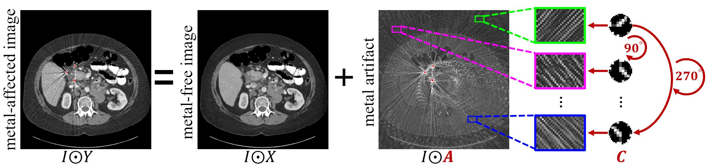
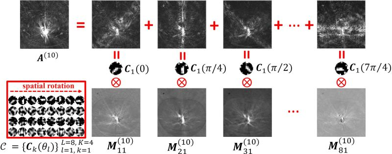

# OSCNet: Orientation-Shared Convolutional Network for CT Metal Artifact Learning (MICCAI 2022, TMI 2023)
[Hong Wang](https://hongwang01.github.io/), Qi Xie, Dong Zeng, Jianhua Ma, [Deyu Meng](http://gr.xjtu.edu.cn/web/dymeng), [Yefeng Zheng](https://sites.google.com/site/yefengzheng/)

[Paper: OSCNet, MICCAI2022](https://drive.google.com/file/d/1SseWsZXe3_DFXVPOWUeNRLndxwhJ6XHc/view?usp=drive_link)

[Paper: OSCNet+, TMI2023](https://drive.google.com/file/d/1ach658FTosbD7h3BHopZM6oj0O-890Uj/view?usp=drive_link)

# Abstract
During X-ray computed tomography (CT) scanning, metallic implants carrying with patients often lead to adverse artifacts in the captured CT images and then impair the clinical treatment. Against this metal artifact reduction (MAR) task, the existing deep-learning-based methods have gained promising reconstruction performance. Nevertheless, there is still some room for further improvement of MAR performance and generalization ability, since some important prior knowledge underlying this specific task has not been fully exploited. Hereby, in this paper, we carefully analyze the characteristics of metal artifacts and propose an orientation-shared convolution representation strategy to adapt the physical prior structures of artifacts, \emph{i.e.}, rotationally symmetrical streaking patterns. The proposed method rationally adopts Fourier-series-expansion-based filter parametrization in artifact modeling, which can better separate artifacts from anatomical tissues and boost the model generalizability. Comprehensive experiments executed on synthesized and clinical datasets show the superiority of our method in detail preservation beyond the current representative MAR methods. 


## Motivation
<div  align="center"></div>


## Model Verification
<div  align="center"></div>

## Dependicies

This repository is tested under the following system settings:
Python 3.6

Pytorch 1.4.0

CUDA 10.1

GPU NVIDIA Tesla V100-SMX2


## Dataset
Please download from [SynDeepLesion](https://github.com/hongwang01/SynDeepLesion), and put the dataset into the folder "data" as:

```
data/train/train_640geo
data/train/train_640geo_dir.txt
data/train/trainmask.npy
data/test/test_640geo
data/test/test_640geo_dir.txt
data/test/testmask.npy
```


## Training
1. Train OSCNet
```
python train.py --gpu_id 0 --data_path "data/train/"  --model "osc" --log_dir "logs_osc/" --model_dir "pretrained_model/model_osc/" --cdiv 1
```

2. Train OSCNet+
```
python train.py --gpu_id 0 --data_path "data/train/"  --model "oscplus" --log_dir "logs_oscplus/" --model_dir "pretrained_model/model_oscplus/" --cdiv 10
```

## Pretrained_models
1. For OSCNet:  "pretrained_model/model_osc/net_latest.pt"

2. For OSCNet+: "pretrained_model/model_oscplus/net_latest.pt"


## Testing

1. Test OSCNet
```
python test.py  --gpu_id 0 --data_path "data/test/" --model "osc" --model_dir "pretrained_model/model_osc/net_latest.pt" --save_path "save_results/" --cdiv 1
```

2. Test OSCNet+

```
python test.py  --gpu_id 0 --data_path "data/test/" --model "oscplus" --model_dir "pretrained_model/model_oscplus/net_latest.pt" --save_path "save_results/" --cdiv 10
```

Reconstruction results can be downloaded from [[NetDisk]](https://pan.baidu.com/s/1mSRPpG6A8LYe6g6YEaRcSA?pwd=osc1)(pwd:osc1)

## Metric
Please refer to "metric/statistic.m"


## Citations
If helpful for your research, please cite our work:

```
@inproceedings{wang2022orientation,
  title={Orientation-Shared Convolution Representation for CT Metal Artifact Learning},
  author={Wang, Hong and Xie, Qi and Li, Yuexiang and Huang, Yawen and Meng, Deyu and Zheng, Yefeng},
  booktitle={International Conference on Medical Image Computing and Computer-Assisted Intervention},
  pages={665--675},
  year={2022}
```

```
@article{wang2023oscnet,
  title={OSCNet: Orientation-Shared Convolutional Network for CT Metal Artifact Learning},
  author={Wang, Hong and Xie, Qi and Zeng, Dong and Ma, Jianhua and Meng, Deyu and Zheng, Yefeng},
  journal={IEEE Transactions on Medical Imaging},
  year={2023}
}
```

## License
The resources of this project are for academic use only, not for any commercial purposes. Please contact us if necessary. 

## Contact
If you have any questions, please feel free to contact Hong Wang (Email: hongwang9209@hotmail.com)
